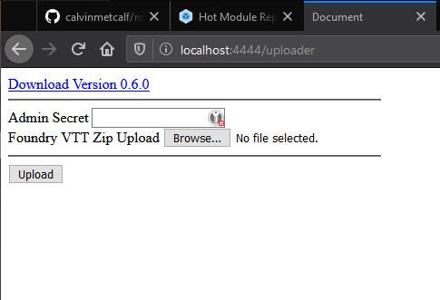
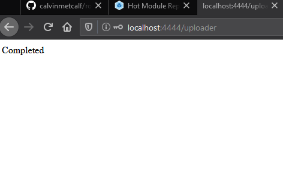

# FoundryVTT Docker

 > THEY HAVE RELEASED!!! You will need to have an active license in order to use this docker.
 > You also need to pay attention to post installation section below.

This is based on the FoundryVTT application, pleaase check them out over on Patreon! :) 
This docker container requires an active license to their beta. 

Please check them out here: [FoundryVTT Patreon](https://www.patreon.com/foundryvtt/posts)

## Installation 

### Running locally

```sh
docker run -rm  \
    -p 4444:4444 \
    -e HOSTNAME="127.0.0.1" \
    -e SSL_PROXY="false" \
    -e VTT_VERSION="0.6.0"  \
    mbround18/foundryvtt-docker:latest
```

Then navigate to http://127.0.0.1:4444

### Running locally with data persistance

```sh
docker run --rm  \
    -p 4444:4444 \
    -e HOSTNAME="127.0.0.1" \
    -e SSL_PROXY="false" \
    -e VTT_VERSION="0.6.0"  \
    -v ${PWD}/data:/foundrydata \ 
    mbround18/foundryvtt-docker:latest
```

Then navigate to http://127.0.0.1:4444


### Running in Kubernetes

TBD


## Post Installation

1. Navigate to your URL ex http://localhost:4444/uploader and upload the zip file from https://foundryvtt.com/
You should be greeted with this screen when you access the uploader screen: 



2. Click browse and navigate to the foundry file. 


3. Open command prompt and execute the command 
```sh 
docker exec -it <CONTAINER-NAME> cat /foundrydata/.admin-password
```
Or if you are running in kubernetes please find a way to get the text from that file. 


4. Click the submit button on the page and wach the logs. If all goes well...



5. Navigate to http://localhost:4444/ and just setup foundry how you normally do :) 
